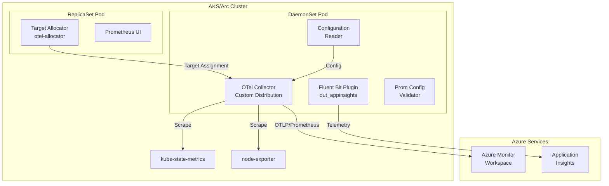

# AGENTS.md

## Setup Commands

```bash
# Prerequisites: Go 1.24+, Make, Docker, Node.js (for TypeScript tool)

# Clone and enter repo
git clone git@github.com:ganga1980/prometheus-collector.git
cd prometheus-collector

# Build the OTel Collector and all components
cd otelcollector/opentelemetry-collector-builder
go mod download
make all

# Build the TypeScript rules converter tool
cd ../../tools/az-prom-rules-converter
npm install
npm run build

# Build mixins (optional)
cd ../../mixins/kubernetes && make
```

## Code Style

### Go
- File naming: `snake_case.go`
- Exported identifiers: `PascalCase`; unexported: `camelCase`
- Imports: stdlib first, then external packages, then internal packages — separated by blank lines
- Error handling: always check `err != nil`; use `log.Fatalf` or return errors, never silently ignore
- Logging: use `log.Printf`/`log.Println` (standard library) in most modules; Fluent Bit plugin uses a custom `FLBLogger`
- No `fmt.Println` for production logging — use structured log calls
- Comments: doc comments on exported functions; inline comments for non-obvious logic
- Type annotations: use explicit types for function signatures; `:=` for local variable inference

### TypeScript (tools/az-prom-rules-converter)
- Uses TypeScript 4.x with strict mode
- Testing with Jest
- Dependencies managed via npm
- Build with `tsc`

### Shell Scripts
- Use `#!/bin/bash` shebang
- Include error handling where appropriate
- Used for deployment scripts, test infrastructure, and OTel upgrade automation

## Testing Instructions

### Ginkgo E2E Tests (Primary)
- **Framework:** Ginkgo v2 + Gomega
- **Location:** `otelcollector/test/ginkgo-e2e/` with suites: `configprocessing`, `containerstatus`, `livenessprobe`, `operator`, `prometheusui`, `querymetrics`, `regionTests`
- **Shared utilities:** `otelcollector/test/ginkgo-e2e/utils/` (constants, helpers)
- **Run:** Requires a bootstrapped AKS cluster. See `otelcollector/test/README.md` for setup.
- **Run locally:** `cd otelcollector/test/ginkgo-e2e/<suite> && go test -v ./...`
- **Test labels:** `operator`, `windows`, `arm64`, `arc-extension`, `fips`
- **Test CRs and configmaps:** `otelcollector/test/test-cluster-yamls/`
- **TestKube:** Production test execution via `otelcollector/test/testkube/`

### TypeScript Unit Tests
- **Framework:** Jest + ts-jest
- **Location:** `tools/az-prom-rules-converter/src/*.test.ts`
- **Run:** `cd tools/az-prom-rules-converter && npm test`

### Adding New Tests
1. Choose the appropriate Ginkgo suite or create a new one
2. Add test label constants to `otelcollector/test/utils/constants.go`
3. Add scrape job configs to `otelcollector/test/test-cluster-yamls/`
4. Update `otelcollector/test/testkube/testkube-test-crs.yaml` for new suites
5. Update PR template checklist if adding new test labels

## Dev Environment Tips

- **Go version:** 1.24+ (check `otelcollector/opentelemetry-collector-builder/go.mod`)
- **Multi-module repo:** Use `go work` or build from individual module directories
- **Docker:** Required for building container images (multi-arch: amd64, arm64)
- **Trivy:** Install for local vulnerability scanning (`trivy fs --severity CRITICAL,HIGH .`)
- **Env vars for telemetry:** `APPLICATIONINSIGHTS_AUTH_PUBLIC`, `APPLICATIONINSIGHTS_AUTH_USGOVERNMENT`, `APPLICATIONINSIGHTS_AUTH_CHINACLOUD` (base64-encoded instrumentation keys)
- **Version files:** `OPENTELEMETRY_VERSION`, `TARGETALLOCATOR_VERSION` at repo root track component versions

## Recommended AI Workflow

### Explore → Plan → Code → Commit
For complex, multi-file changes:
1. **Explore** — Ask AI to read and explain relevant code: "Read the OTel collector builder and explain how components are registered"
2. **Plan** — Ask for a structured plan: "Plan how to add a new processor to the collector pipeline"
3. **Code** — Implement step by step: "Implement step 1: add the processor dependency to go.mod"
4. **Test** — Run tests: `cd otelcollector/opentelemetry-collector-builder && make all`
5. **Commit** — Use conventional commits: `feat: add new processor to collector pipeline`

### Validating AI-Generated Code
1. Run `make all` in the builder directory
2. Run Ginkgo tests for affected suites
3. Run `npm test` for TypeScript changes
4. Check `trivy fs --severity CRITICAL,HIGH .` for vulnerability impact
5. Verify code follows patterns in `.github/instructions/` files

## PR Instructions

- **Commit format:** Conventional Commits preferred (`feat:`, `fix:`, `build(deps):`, `test:`, `ci/cd:`)
- **Branch naming:** Feature branches from `main`
- **PR template:** `.github/pull_request_template.md` — fill out the New Feature Checklist and Tests Checklist
- **Required:** Ginkgo E2E test results, test labels used, new test additions for features
- **Merge strategy:** Squash merge
- **Release notes:** Update `RELEASENOTES.md` or `REMOTE-WRITE-RELEASENOTES.md` for user-facing changes

## Architecture Diagram


