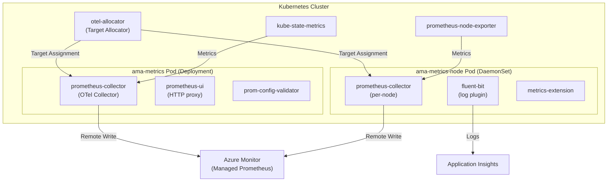

# AGENTS.md

## Setup Commands

```bash
# Prerequisites: Go 1.23+, Docker, Helm 3, Node.js 18+ (for TypeScript tool)

# Clone and enter repo
git clone git@github.com:ganga1980/prometheus-collector.git
cd prometheus-collector

# Build the main OTel collector
cd otelcollector/opentelemetry-collector-builder
make

# Build the target allocator
cd ../otel-allocator
make

# Build the TypeScript rules converter (optional)
cd ../../tools/az-prom-rules-converter
npm install
npm run build

# Build Prometheus mixins (optional)
cd ../../mixins/kubernetes
make all
```

## Code Style

### Go
- **Naming:** `camelCase` for variables/functions, `PascalCase` for exported types
- **Imports:** Standard library first, then third-party (Azure SDK, OTel, K8s), then internal
- **Error handling:** Always check errors; use `log.Fatal(err)` for critical startup failures, `shared.EchoError()` for recoverable errors
- **Logging:** Standard `log` package in main services, `slog` in prometheus-ui, `ctrl.Log` in allocator
- **Config:** Environment variables via `os.Getenv()` or `shared.GetEnv("KEY", "default")`
- **Comments:** Minimal — self-documenting code preferred

### Shell/Bash
- Variables: `UPPERCASE_WITH_UNDERSCORES`
- Use `set -e` for error propagation
- Guard clauses for required parameters
- Package installs via `tdnf` (Mariner Linux)

### TypeScript
- Functional pipeline pattern (step processors)
- Module imports with relative paths
- Jest for testing

### YAML/Helm
- 2-space indentation
- Helm values use `camelCase`
- Comments for non-obvious template logic

## Testing Instructions

**Framework:** Ginkgo v2 + Gomega (BDD-style Go testing)

**Run unit tests:**
```bash
cd otelcollector/<module>
go test ./...
```

**Run E2E tests (requires K8s cluster):**
```bash
cd otelcollector/test/ginkgo-e2e/<suite>
go test -v ./... -label-filter="<label>"
```

**Test labels:** `ConfigProcessingCommon`, `operator`, `windows`, `arm64`, `arc-extension`, `fips`

**Test naming:** `*_test.go` files, `DescribeTable` + `Entry` pattern for parameterized tests.

**TypeScript tests:**
```bash
cd tools/az-prom-rules-converter
npm test
```

**Adding new tests:**
1. Create `*_test.go` in the appropriate `ginkgo-e2e/<suite>/` directory
2. Use `DescribeTable`/`Entry` pattern with appropriate labels
3. Add test label to `otelcollector/test/ginkgo-e2e/utils/constants.go`
4. Update `otelcollector/test/README.md` and `.github/pull_request_template.md`

## Dev Environment Tips

- **Go version:** 1.23+ (check individual `go.mod` files)
- **Multiple Go modules:** Each directory with `go.mod` is independent; `cd` into it before running `go` commands
- **OTel versions:** Tracked in `OPENTELEMETRY_VERSION` and `TARGETALLOCATOR_VERSION` files at repo root
- **Docker builds:** Multi-stage; Linux Dockerfile builds fluent-bit, prometheus-ui, otelcollector, and prom-config-validator
- **Helm development:** Use `helm template` to preview rendered manifests before deploying

## Recommended AI Workflow

### Explore → Plan → Code → Commit

For complex, multi-file changes:

1. **Explore** — Ask the AI to read and explain relevant code.
   ```
   "Read otelcollector/main/main.go and explain the startup sequence"
   ```
2. **Plan** — Ask for a structured implementation plan.
   ```
   "Plan how to add a new scrape target for GPU metrics. List all files that need changes."
   ```
3. **Code** — Implement incrementally.
   ```
   "Implement step 1: add the DCGM exporter default config"
   ```
4. **Test** — Run tests after each change.
   ```
   "Run go test ./... in otelcollector/configmapparser/"
   ```
5. **Commit** — Follow Conventional Commits.
   ```
   "Commit with message: feat: add DCGM exporter scrape target"
   ```

### Choosing the Right AI Tool
- **Inline suggestions** — Best for Go code completion, variable names, error handling boilerplate
- **Copilot Chat** — Best for questions about OTel collector architecture, Helm chart templating
- **Copilot CLI** — Best for multi-file changes across Go modules and Helm charts
- **@CodeReviewer** — Best for reviewing PRs against repo conventions

### Validating AI-Generated Code
1. Run `make` in the affected Go module
2. Run `go test ./...` for unit tests
3. Run `helm lint` for chart changes
4. Check for hardcoded secrets or credentials
5. Verify error handling follows existing patterns

## PR Instructions

- **Commit format:** Conventional Commits (`feat:`, `fix:`, `test:`, `build(deps):`, `ci/cd:`)
- **Branch naming:** `<type>/<description>` (e.g., `feat/gpu-metrics`, `fix/arm64-build`)
- **PR template:** `.github/pull_request_template.md` — fill in description, feature checklist, and test checklist
- **Required:** E2E test results, new test labels documented, scrape job configs if applicable
- **Merge strategy:** Squash merge

## Architecture Diagram


