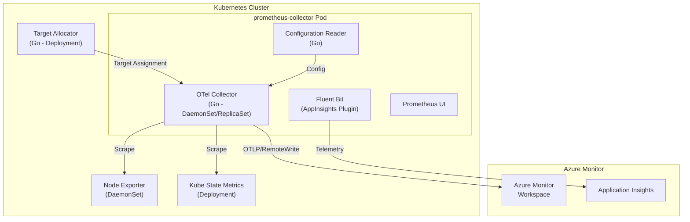

# AGENTS.md

## Setup Commands

```bash
# Clone and enter the repository
git clone https://github.com/ganga1980/prometheus-collector.git
cd prometheus-collector

# Install Go (1.23+) — verify with:
go version

# Build the main OTel collector
cd otelcollector
go mod download
go build ./...

# Build the custom collector binary
cd opentelemetry-collector-builder
go build -o otelcollector .
cd ../..

# (Optional) TypeScript rules converter
cd tools/az-prom-rules-converter
npm install
npm run build
cd ../..

# (Optional) Prometheus mixins — requires jsonnet-bundler
cd mixins/kubernetes
make
cd ../..
```

## Code Style

### Go
- **Naming**: `camelCase` for functions/variables, `PascalCase` for exported identifiers, `UPPERCASE` for constants.
- **Imports**: Grouped by standard library, then external packages, separated by blank lines. Kubernetes client imports are aliased (e.g., `corev1 "k8s.io/api/core/v1"`).
- **Error handling**: Always wrap errors with context using `fmt.Errorf("doing X: %w", err)`. Use `log.Fatalf()` for unrecoverable startup errors.
- **Logging**: Standard `log` package in main components, `log/slog` for structured logging in the Prometheus receiver. Custom lumberjack-based logger in Fluent Bit plugin.
- **Type annotations**: Explicit types everywhere. Use `interface{}` with type assertions where needed.

### Shell (Bash)
- Always start scripts with `set -e` for strict error handling.
- Use `UPPERCASE` for environment variables, lowercase for local variables.
- Quote all variable expansions: `"${VAR}"`.
- Check exit codes explicitly after critical operations: `if [ $? -ne 0 ]; then`.

### TypeScript
- Build with `tsc`, test with `jest`/`ts-jest`.
- Follow standard TypeScript conventions with strict typing.

### YAML/Jsonnet
- Kubernetes manifests follow standard K8s conventions.
- Jsonnet mixins follow the monitoring-mixins convention with `_config` variables.

## Testing Instructions

### Ginkgo E2E Tests (Primary)
The main test framework is **Ginkgo v2** with **Gomega** matchers. Tests require a bootstrapped Kubernetes cluster.

```bash
# Bootstrap a dev cluster first (see otelcollector/test/README.md)
# Then run specific test suites:
cd otelcollector/test/ginkgo-e2e/<suite-name>
go test -v ./... -ginkgo.label-filter="<label>"
```

**Test labels**: `operator`, `windows`, `arm64`, `arc-extension`, `fips`

**Test suites** (under `otelcollector/test/ginkgo-e2e/`):
- Default targets, custom config, operator, Windows, ARM64, Arc extension, FIPS, livenessprobe

### Go Unit Tests
```bash
cd otelcollector && go test ./...
```

### TypeScript Tests
```bash
cd tools/az-prom-rules-converter && npm test
```

### Adding New Tests
1. Place test files next to source code following `*_test.go` naming.
2. For E2E: add scrape jobs in `otelcollector/test/test-cluster-yamls/`.
3. New test labels → add constant in `otelcollector/test/utils/constants.go` and update `otelcollector/test/README.md`.
4. New test suites → add to `otelcollector/test/testkube/testkube-test-crs.yaml`.

## Dev Environment Tips

- **Go version**: 1.23+ required (toolchain 1.23.8 in main module).
- **Multiple go.mod files**: 24 modules exist — `otelcollector/go.mod` is primary with `replace` directives for `shared/`.
- **Docker**: Required for building container images (Linux multi-arch: amd64, arm64).
- **Helm**: Required for chart packaging (`helm package`).
- **kubectl**: Required for E2E test cluster management.
- **Environment variables** for tests: `CLUSTER`, `AKSREGION`, `customEnvironment`, `MODE` (advanced/noDefaultScrapingEnabled).

## PR Instructions

- **Commit format**: Conventional Commits — `feat:`, `fix:`, `docs:`, `test:`, `build:`, `ci:`, `refactor:`.
- **Branch naming**: Feature branches, no enforced naming convention.
- **PR template**: Fill `.github/pull_request_template.md` — includes new feature checklist and Ginkgo test checklist.
- **Required checks**: Trivy vulnerability scanning, image size tracking, stale issue management.
- **Merge strategy**: Squash merge preferred for clean history.
- **Dependency updates**: Managed by Dependabot (daily schedule for Go modules and GitHub Actions).

## Architecture Diagram


